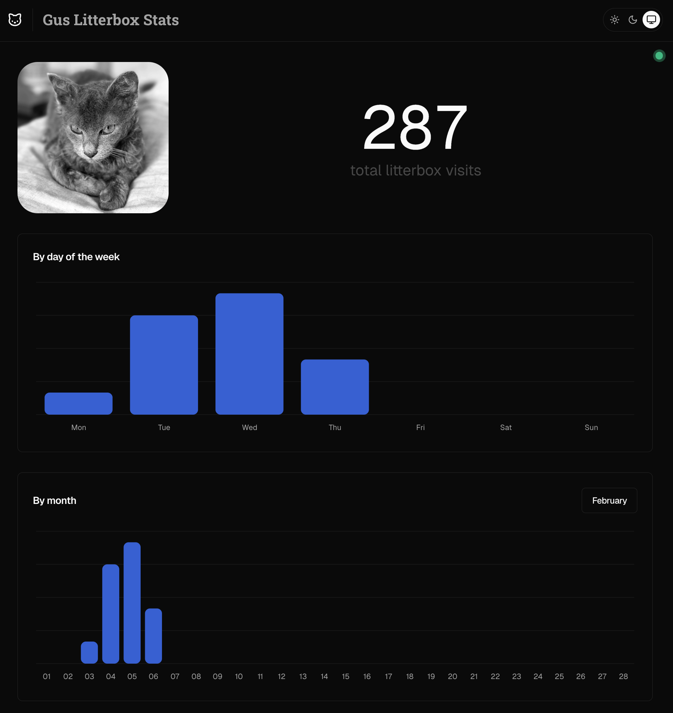

<h1 align="center">🐈‍⬛ Gus Litterbox Stats 📊</h1>

Enterprise-grade, cloud-native feline waste analytics platform leveraging AI-driven insights for the modern cat owner.

  

## Overview

Revolutionizing the pet hygiene monitoring space, this cutting-edge platform tracks and analyzes my cat Gus's litterbox usage patterns through our proprietary FelineOps™ methodology, delivering actionable insights into daily routines and health indicators.

## Features

- Real-time litterbox visit tracking with blockchain-verified timestamps
- IoT-enabled duration monitoring via our patented SmartTracking™ technology
- Time pattern analysis through our quantum-inspired algorithms
- Waste trend indicators powered by our LitterOps™ platform
- Seamless integration with my cat infrastructure
- Military-grade feline data architecture

## Tech stack

- [Next.js 15](https://nextjs.org/) - React framework
- [TypeScript](https://www.typescriptlang.org/) - Type safety
- [Tailwind CSS](https://tailwindcss.com/) - Styling
- [shadcn/ui](https://ui.shadcn.com/) - UI components
- [Recharts](https://recharts.org/) - Chart visualizations
- [Motion One](https://motion.dev/) - Animations
- [Radix UI](https://www.radix-ui.com/) - Headless UI primitives
- [Convex](https://www.convex.dev/) - Backend platform
  - Real-time database
  - HTTP API endpoints
  - Query & mutation functions
